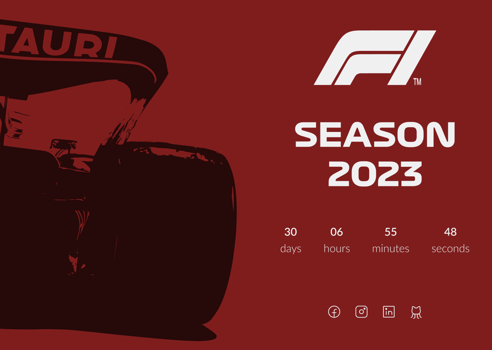
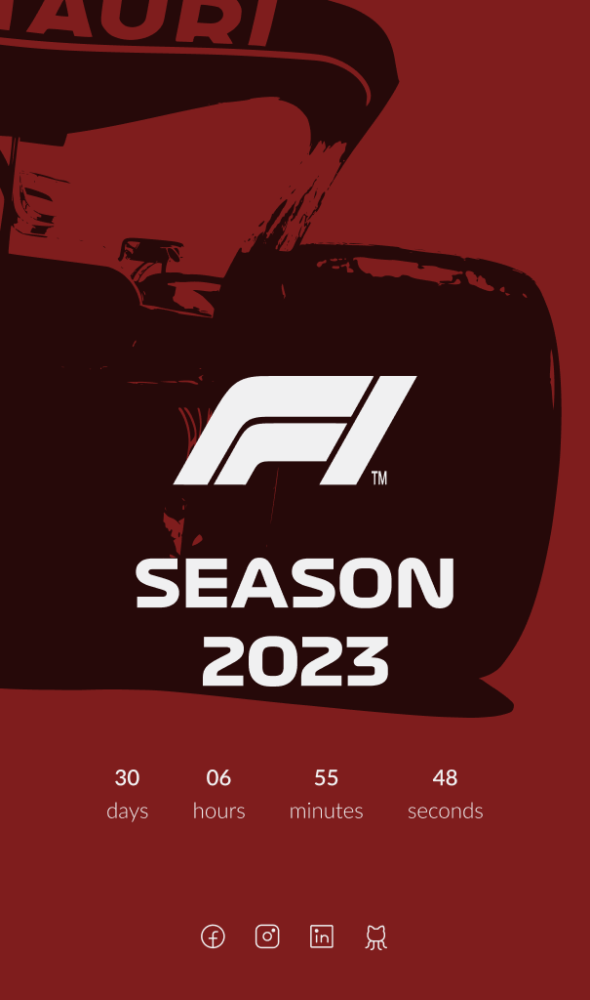

# F1 Timer

<div align="center">

[]()
[]()
[]()

</div>

---

## 📝 Sumário

- [Sobre](#about)
- [Layout](#layout)
- [Como Executar o Projeto](#execute_project)
- [Tecnologias](#technologies)
- [Como contribuir para o projeto](#fork)
- [Autora](#author)

<br>

## 🧐 About <a name = "about"></a>

<p>O projeto tem como objetivo criar uma contagem regressiva. </p>
<p>O tema escolhido foi a temporada 2023 da Fórmula 1. </p>

<br>
 
## 🎨 Layout <a name = "layout"></a>

O layout da aplicação está disponível no Figma:

<a href="https://www.figma.com/file/8A8aJ8BrToUvxH2RP06Lb2/Formula-1?node-id=0%3A1&t=9VH5r1kJ6FBKCO4H-1">
  
</a>

<br>

<div style="display: flex;">


  
</div>

<br>

## 🚀 Como executar o projeto <a name = "execute_project"></a>

### Pré-requisitos

Você vai precisar apenas de um editor de código.
Recomendo o [VSCode](https://code.visualstudio.com/).

<br>

#### 🧭 Rodando a aplicação web (Frontend)

```bash

# Clone este repositório
$ git clone git@github.com:naycorrea/timer-web.git

# Acesse a pasta do projeto no seu terminal/cmd
$ cd timer-web

# Vá para a pasta da aplicação Front End
$ cd timer-web

# Abra o editor de código
$ code .


# o VSCode será aberto

```

<br>

Abra a aplicação em um navegador. Pode utilizar a extensão Live Server no próprio VSCode.

```bash

# A aplicação será aberta

```

<br>

## 🛠 Tecnologias <a name = "technologies"></a>

As seguintes ferramentes foram usadas na construção do projeto:

### **Website** ([HTML5](https://developer.mozilla.org/pt-BR/docs/Web/HTML))

- **[CSS3](https://developer.mozilla.org/pt-BR/docs/Web/CSS)**
- **[JavaScript](https://www.javascript.com/)**

<br>
<br>

## 💪 Como contribuir para o projeto <a name = "fork"></a>

1. Faça um **fork** do projeto.
2. Crie uma nova branch com as suas alterações: `git checkout -b my-feature`
3. Salve as alterações e crie uma mensagem de commit contando o que você fez: `git commit -m "feature: My new feature"`
4. Envie as suas alterações: `git push origin my-feature`

<br>
<br>

## 👩🏾‍💻 Autora <a name = "author"></a>

<a href="https://app.rocketseat.com.br/me/nayaraflorentino-1602180404901">
 
 <br />
 <sub><b>Nayara Corrêa</b></sub></a> <a href="https://app.rocketseat.com.br/me/nayaraflorentino-1602180404901" title="Rocketseat">🚀
 </a>

Feito por Nayara Corrêa 👋🏽 Entre em contato!

[](https://www.linkedin.com/in/nayaracorreaflorentino/)
[](https://www.facebook.com/naycorrea.dev/)
[](https://www.instagram.com/naycorrea.dev/)
[](mailto:naycorrea.dev@gmail.com)
